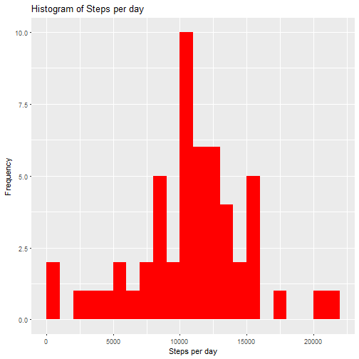
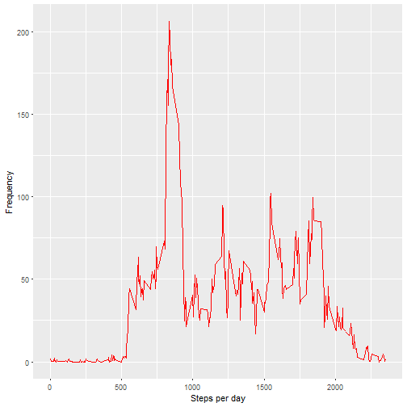
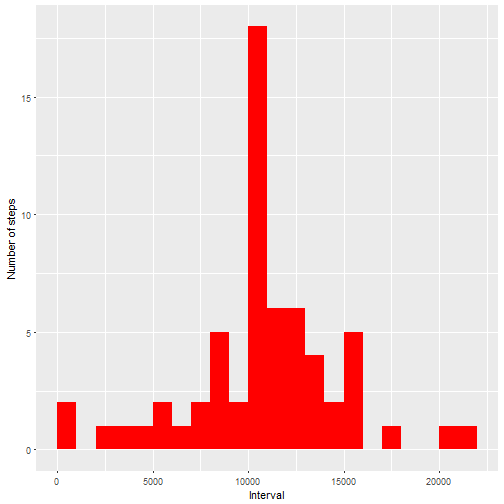
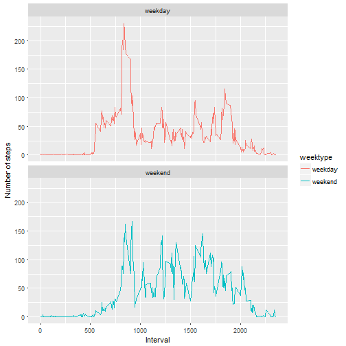

## Introduction
It is now possible to collect a large amount of data about personal movement using activity monitoring devices such as a [Fitbit](http://www.fitbit.com/), [Nike Fuelband](http://www.nike.com/us/en_us/c/nikeplus-fuelband), or [Jawbone Up](https://jawbone.com/up). These type of devices are part of the "quantified self" movement - a group of enthusiasts who take measurements about themselves regularly to improve their health, to find patterns in their behavior, or because they are tech geeks. But these data remain under-utilized both because the raw data are hard to obtain and there is a lack of statistical methods and software for processing and interpreting the data.

This assignment makes use of data from a personal activity monitoring device. This device collects data at 5 minute intervals through out the day. The data consists of two months of data from an anonymous individual collected during the months of October and November, 2012 and include the number of steps taken in 5 minute intervals each day.

The data for this assignment can be downloaded from the course web site:

- Dataset: [Activity monitoring data](https://d396qusza40orc.cloudfront.net/repdata%2Fdata%2Factivity.zip) [52K]

The variables included in this dataset are:

- steps: Number of steps taking in a 5-minute interval (missing values are coded as NA)  
- date: The date on which the measurement was taken in YYYY-MM-DD format  
- interval: Identifier for the 5-minute interval in which measurement was taken  

The dataset is stored in a comma-separated-value (CSV) file and there are a total of 17,568 observations in this dataset.

### Assumptions
Prior running the document code the dataset file must be already downloaded and extracted to your working folder. If not, please download the file [here](https://d396qusza40orc.cloudfront.net/repdata%2Fdata%2Factivity.zip), unzip and save it to your working folder.  

### Required packages
The document code requires <font color="red">`dplyr`</font> and <font color="red">`ggplot2`</font> packages.  

```r
library(dplyr)
library(ggplot2)
```

## Loading and preprocessing the data  
Show any code that is needed to  
1. Load the data (i.e. <font color="red">`read.csv()`</font>)  
2. Process/transform the data (if necessary) into a format suitable for your analysis  

### Reading in the dataset
The data set is loaded using <font color="red">`read.csv()`</font>.


```r
    ds <- read.csv('activity.csv')
```

### Exploratory data

```r
    names(ds)
```

```
## [1] "steps"    "date"     "interval"
```

```r
    dim (ds)
```

```
## [1] 17568     3
```

```r
    str (ds)
```

```
## 'data.frame':	17568 obs. of  3 variables:
##  $ steps   : int  NA NA NA NA NA NA NA NA NA NA ...
##  $ date    : Factor w/ 61 levels "2012-10-01","2012-10-02",..: 1 1 1 1 1 1 1 1 1 1 ...
##  $ interval: int  0 5 10 15 20 25 30 35 40 45 ...
```

```r
    head(ds)
```

```
##   steps       date interval
## 1    NA 2012-10-01        0
## 2    NA 2012-10-01        5
## 3    NA 2012-10-01       10
## 4    NA 2012-10-01       15
## 5    NA 2012-10-01       20
## 6    NA 2012-10-01       25
```

## What is mean total number of steps taken per day?
For this part of the assignment, you can ignore the missing values in the dataset.  
1. Calculate the total number of steps taken per day.  
2. Make a histogram of the total number of steps taken each day.  
3. Calculate and report the mean and median total number of steps taken per day.  

### Method and Result
* Using <font color="red">`dplyr`</font> package to calculate the total number of steps per day  

```r
    daySteps <- ds %>%
        filter(!is.na(steps)) %>%
        group_by(date) %>%
        summarize(steps=sum(steps))
    daySteps
```

```
## # A tibble: 53 x 2
##          date steps
##        <fctr> <int>
##  1 2012-10-02   126
##  2 2012-10-03 11352
##  3 2012-10-04 12116
##  4 2012-10-05 13294
##  5 2012-10-06 15420
##  6 2012-10-07 11015
##  7 2012-10-09 12811
##  8 2012-10-10  9900
##  9 2012-10-11 10304
## 10 2012-10-12 17382
## # ... with 43 more rows
```

* Using <font color="red">`ggplot`</font> to make Histogram of total steps per day  

```r
    ggplot(daySteps, aes(x=steps)) +
        geom_histogram(binwidth=1000, boundary=0, fill='red') +
        labs(title="Histogram of Steps per day", x="Steps per day", y="Frequency")
```



* Using <font color="red">`mean()`</font> and <font color="red">`median()`</font> to report mean and median steps  

```r
    mean_daySteps <- mean(daySteps$steps, na.rm=TRUE)
    mean_daySteps
```

```
## [1] 10766.19
```

```r
    median_daySteps <- median(daySteps$steps, na.rm=TRUE)
    median_daySteps
```

```
## [1] 10765
```

The Mean steps are **10766** and Median steps are **10765**.  


## What is the average daily activity pattern?
1. Make a time series plot (i.e. type = "l") of the 5-minute interval (x-axis) and the average number of steps taken, averaged across all days (y-axis)  
2. Which 5-minute interval, on average across all the days in the dataset, contains the maximum number of steps?  

### Method and Result
* Using <font color="red">`dplyr`</font> package to calculate the average number of steps in each 5-minute interval

```r
    avgSteps <- ds %>%
        filter(!is.na(steps)) %>%
        group_by(interval) %>%
        summarize(steps=mean(steps))
    avgSteps
```

```
## # A tibble: 288 x 2
##    interval     steps
##       <int>     <dbl>
##  1        0 1.7169811
##  2        5 0.3396226
##  3       10 0.1320755
##  4       15 0.1509434
##  5       20 0.0754717
##  6       25 2.0943396
##  7       30 0.5283019
##  8       35 0.8679245
##  9       40 0.0000000
## 10       45 1.4716981
## # ... with 278 more rows
```

* Using <font color="red">`ggplot`</font> to make time series plot of he 5-minute interval (x-axis) and the average number of steps taken

```r
    ggplot(avgSteps, aes(x=interval, y=steps)) +
        geom_line(color='red') +
        labs(x="Steps per day", y="Frequency")
```



* Using <font color="red">`which.max()`</font> to find the maximum average steps taken across all days

```r
    maxStepsInterval <- which.max(avgSteps$steps)
    avgSteps[maxStepsInterval,]
```

```
## # A tibble: 1 x 2
##   interval    steps
##      <int>    <dbl>
## 1      835 206.1698
```

The Interval **835** has the highest average count of steps with **206** steps.  


## Imputing missing values
Note that there are a number of days/intervals where there are missing values (coded as <font color="red">`NA`</font>). The presence of missing days may introduce bias into some calculations or summaries of the data.  
1. Calculate and report the total number of missing values in the dataset (i.e. the total number of rows with <font color="red">`NA`</font>s)  
2. Devise a strategy for filling in all of the missing values in the dataset. The strategy does not need to be sophisticated. For example, you could use the mean/median for that day, or the mean for that 5-minute interval, etc.  
3. Create a new dataset that is equal to the original dataset but with the missing data filled in.  
4. Make a histogram of the total number of steps taken each day and Calculate and report the mean and median total number of steps taken per day. Do these values differ from the estimates from the first part of the assignment? What is the impact of imputing missing data on the estimates of the total daily number of steps?  

### Method and Result
* Compute the total missing value.  

```r
    sum(is.na(ds$steps))
```

```
## [1] 2304
```

There are **2304** missing value in total.  

* Taking the approach to fill in a missing value with the average steps in the same 5-minute interval. 
To do this we are re-using the variable <font color="red">`avgSteps`</font> that already held average number of steps in each 5-minute interval cross all days to fill in missing values.  

```r
    avgInterval <- avgSteps$steps
    names(avgInterval) <- as.character(avgSteps$interval)
```

* Creating a new dataset that is equal to the original dataset but with the missing data filled in.  

```r
    imputing_ds <- ds
    nas <- is.na(imputing_ds$steps)
    imputing_ds$steps[nas] <- avgInterval[as.character(imputing_ds$interval[nas])]
```

There are **0** missing value in new dataset <font color="red">`imputing_ds`</font>.  
  
  
* Using <font color="red">`dplyr`</font> package to calculate the total number of steps per day and making Histogram by using <font color="red">`ggplot`</font>.

```r
    imputing_daySteps <- imputing_ds %>%
        filter(!is.na(steps)) %>%
        group_by(date) %>%
        summarize(steps=sum(steps))
    imputing_daySteps
```

```
## # A tibble: 61 x 2
##          date    steps
##        <fctr>    <dbl>
##  1 2012-10-01 10766.19
##  2 2012-10-02   126.00
##  3 2012-10-03 11352.00
##  4 2012-10-04 12116.00
##  5 2012-10-05 13294.00
##  6 2012-10-06 15420.00
##  7 2012-10-07 11015.00
##  8 2012-10-08 10766.19
##  9 2012-10-09 12811.00
## 10 2012-10-10  9900.00
## # ... with 51 more rows
```

```r
    ggplot(imputing_daySteps, aes(x=steps)) +
        geom_histogram(binwidth=1000, boundary=0, fill='red') +
        labs(x="Interval", y="Number of steps")
```




* Calculating and report mean and median steps against new dataset.  

```r
    imputing_mean <- mean(imputing_daySteps$steps, na.rm=TRUE)
    imputing_mean
```

```
## [1] 10766.19
```

```r
    imputing_median <- median(imputing_daySteps$steps, na.rm=TRUE)
    imputing_median
```

```
## [1] 10766.19
```

The Mean steps is **10766** and Median steps is **10766**.  

The impact of imputing missing data with average number of steps in the same 5-minute interval is that the both mean and median are equal to same value **10766**.  
  
  
## Are there differences in activity patterns between weekdays and weekends?
For this part the weekdays() function may be of some help here. Use the dataset with the filled-in missing values for this part.  
1. Create a new factor variable in the dataset with two levels - "weekday" and "weekend" indicating whether a given date is a weekday or weekend day.  
2. Make a panel plot containing a time series plot (i.e. type = "l") of the 5-minute interval (x-axis) and the average number of steps taken, averaged across all weekday days or weekend days (y-axis).  
  
  
### Method and Result
* First of all we are using <font color="red">`mutate`</font> (a function of <font color="red">`dplyr`</font> package) to add a new variable <font color="red">`weektype`</font> to imputing dataset <font color="red">`imputing_ds`</font>. The variable is of factor type with two levels - "weekday" and "weekend".  

```r
    imputing_ds$date <- as.Date(imputing_ds$date)
    imputing_ds <- mutate(imputing_ds, 
                          weektype = if_else(weekdays(imputing_ds$date) == 'Saturday' | 
                                            weekdays(imputing_ds$date) == 'Sunday', 
                                            'weekend', 'weekday'))
    imputing_ds$weektype <- as.factor(imputing_ds$weektype)
    head(imputing_ds)
```

```
##       steps       date interval weektype
## 1 1.7169811 2012-10-01        0  weekday
## 2 0.3396226 2012-10-01        5  weekday
## 3 0.1320755 2012-10-01       10  weekday
## 4 0.1509434 2012-10-01       15  weekday
## 5 0.0754717 2012-10-01       20  weekday
## 6 2.0943396 2012-10-01       25  weekday
```
  
  
* Using <font color="red">`dplyr`</font> package to calculate the average number of steps in each 5-minute interval and averaged across all weekday days or weekend days.  

```r
    imputing_avgSteps <- imputing_ds %>%
        group_by(interval, weektype) %>%
        summarize(steps=mean(steps))
```
  
  
* Using <font color="red">`ggplot`</font> to make a panel plot containing a time series plot (i.e. type = "l") of the 5-minute interval (x-axis) and the average number of steps taken, averaged across all weekday days or weekend days (y-axis).  

```r
    ggplot(imputing_avgSteps, aes(x=interval, y=steps, color=weektype)) +
        geom_line() +
        labs(x="Interval", y="Number of steps") +
        facet_wrap(~weektype, ncol=1, nrow=2)
```


  
From the two plots it seems that the person is more active earilier in the day during weekdays compared to weekend, 
but the person is more active throughout the day in weekend.
  
